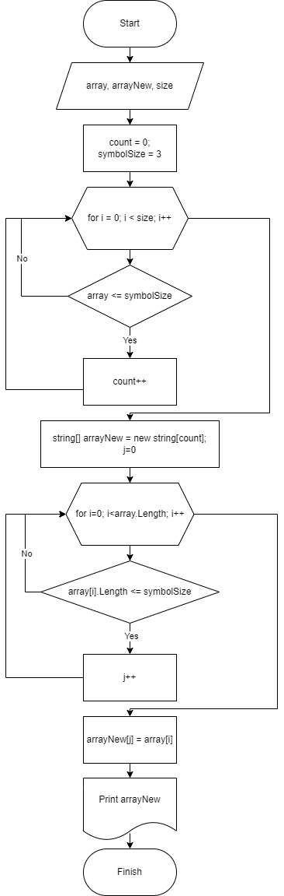

### Документация

## Условия задачи:

Написать программу, которая из имеющегося массива строк формирует массив из строк, длина которых меньше либо равна 3 символа. Первоначальный массив можно ввести с клавиатуры, либо задать на старте выполнения алгоритма. При решение не рекомендуется пользоваться коллекциями, лучше обойтись исключительно массивами

Примеры: [“Hello”, “2”, “world”, “:-)”] → [“2”, “:-)”] [“1234”, “1567”, “-2”, “computer science”] → [“-2”] [“Russia”, “Denmark”, “Kazan”] → []


## Аннотация

1. Запрос. Введите колличество элементов массива.
2. Присваиваем введенное колличество элементов переменной *size*.
3. Запрос. Введите элемменты массива.
4. Выполнив цикл for (int i = 0; i < size; i++), выводим на экран результат введенного массива.
5. с помощью цикла for (int i = 0; i < array.Length; i++) перебераем элементы массива и если условие верное array[i].Length <= symbolSize ,тогда записываем в массив arrayNew.
6. Выводим полученный результат.

## Блок-схема программы



## Исходный код

```
Console.WriteLine("Введите количество элементов массива: ");
int size = int.Parse(Console.ReadLine());

string[] array = new string[size];

for (int i = 0; i < size; i++)
{
  Console.Write("Введите элемент массива: ");
  string result = Console.ReadLine();
  array[i] = result;
}
Console.WriteLine(string.Join(",", array));

int count = 0;
int symbolSize = 3;

for (int i = 0; i < array.Length; i++)
{
  if (array[i].Length <= symbolSize)
  {
    count++;
  }
}
Console.WriteLine("Полученный массив из строк с длиной не более 3 символа: ");

string[] newArray = new string[count];
int j = 0;
for (int i = 0; i < array.Length; i++)
{
  if (array[i].Length <= symbolSize)
  {
    newArray[j] = array[i];
    Console.Write(newArray[j] + ",");
    j++;
  }
}

```
## Инструкция пользователя

1. Введите количество элементов массива (только числовое значение);
2. Введите последовательно все элементы массив;
3. Просмотрите введенный массив
4. Просмотрите сформированный массив
5. Повторите проделанное.